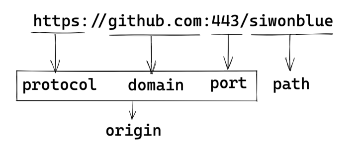
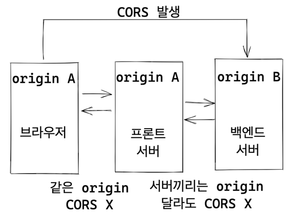
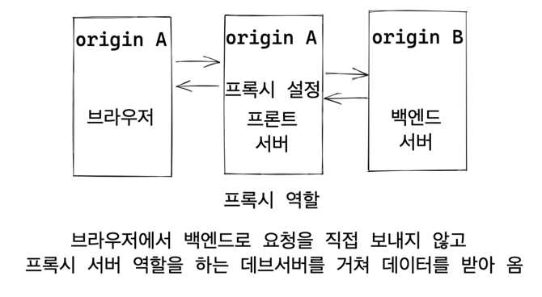

# 📍 REVIEW

웹팩은 복잡한 것을 모아서 하나로 만들어 내는 프로그램이다.  
조금 더 기술적으로 표현하자면,  웹 자원 모듈을 모아
번들링 해주는 모듈 번들러이다.
> 복잡한 것(= 다양한 웹 자원), 하나로 만들기(= 번들링)

웹팩 핵심 개념 네 가지를 기억하자.
- entry
- loader
- plugin
- output

entry 웹팩 프로세스가 시작될 파일을 의미한다.
output 은 웹팩 프로세스가 끝나고 나면 결과물이 나오는 경로와 파일을 설정한다.
loader 는 여러 웹 자원을 모두 js 로 변경시켜 준다.
plugin 은 결과물을 어떤 방식으로 이용할지에 대한 설정을 한다.

> 여기서 표현한 웹팩 프로세스를 빌드(=번들링, 트랜스파일) 이라 함.


# 📌 webpack dev server

## 데브 서버 왜 사용할까

우선 데브 서버를 이용하는 이유에 대해서 알아본다.

### 생산성 저하
코드가 바뀌고 나면 매번 빌드 명령어를 이용해서 수동으로 변경 사항을 업데이트 해야 하는데
이 점은 생산성을 떨어트린다.

### CORS 

Cross Origin Resource Sharing, 한글로 교차 자원 공유 문제는 브라우저와 백엔드 서버가
통신할 때 발생하는 오류 중 하나다. CORS 에 연관되어 있는 주체는 다음과 같다.
- 브라우저
- 프론트 서버
- 백엔드 서버

(프로토콜 + 도메인 + 포트 = origin) 이라고 하는데 브라우저와 통신하는 주체가 브라우저와 origin이 다르면
CORS 가 발생한다. 이 때 세 가지 모두 같아야 origin 이 같다고 판단한다. 일반적으로 <U>백엔드서버와 브라우저의 origin 이 달라서</U> CORS 문제가 <U>발생</U>한다.

  
[그림1. origin 예시]

> CORS 는 브라우저가 발생시키는 것.  
> 프론트 서버와 백엔드 서버가 서로 origin이 다른 경우는 CORS 문제가 없음.

CORS 문제에 대한 해결책은 다음과 같다.

- 백엔드에서 해결하는 방법 : CORS 허용 도메인 설정
- 프론트에서 해결하는 방법 : proxy 서버 사용  

proxy 는 대리인이라는 의미를 가지고 있는데 대리 서버 역할을 웹팩 데브 서버가 해주는 것이다.
 
 
CORS 가 왜 발생하는지 그림으로 살펴보자. [그림2] 를 보게 되면 브라우저가 백엔드 서버로 직접 요청을 보내고 있다.
origin이 달라서 CORS 가 발생한다.

  
[그림2. CORS 발생 경우, 브라우저가 자신과 origin 이 다른 백엔드 서버에 데이터를 직접 요청 하고 있음.]
   
<br/>

[그림3]을 확인해보자. 우리가 웹팩 데브 서버를 설정하고 이를 프록시 서버로 활용하게 된다면
브라우저가 같은 origin 을 가진 프록시 서버에 요청을 보내고 이 서버가 백엔드 서버에서 요청을 받아와
전달해주는 역할을 한다. 

> 서버끼리는 origin 이 달라도 CORS 가 발생하지 않는 점을 이용

  
[그림3. 프록시 서버를 이용하여 CORS 문제 해결]

### 결론
생산성 저하와 CORS 문제 해결을 위하여 웹팩을 이용해서
데브 서버를 세팅한다.


## 실습

### 동작 방식
- webpack.config.js 에서 설정파일에 대한 내용을 확인
- front.js 에서 브라우저와 프론트 서버에 대한 실습 예제 작성
- server.js 에서 백엔드 서버에 대한 실습 예제 작성

### 코드 설명
- 웹스톰 라이브 서버로 브라우저는 http://localhost:63322 origin 사용
- 프론트 서버는 브라우저와 동일
- 브라우저에서 index.html 이 로드 되면 server.js 에서 fetch 실행
- origin 이 다른 백엔드 서버(server.js) 로 요청을 보내게 되어 있음.
- 하지만 프록시 설정이 되어 있기 때문에 이 요청은 바로 백엔드 서버로 전송되지 않고
- 프론트 프록시 서버를 경유하게 됨.
- CORS 오류 발생하지 않고 정상 통신


### webpack.config.js
- webpack.config.js 파일은 객체를 export
- 객체에 대한 property 로 모든 설정을 하게 됨.
- devServer 라는 property 위 언급한 문제를 모두 해결 가능.
  
```js
module.exports = {
  
  devServer : {
    proxy : {
      
    },
    
  }
  
}
```

### 하는 중...